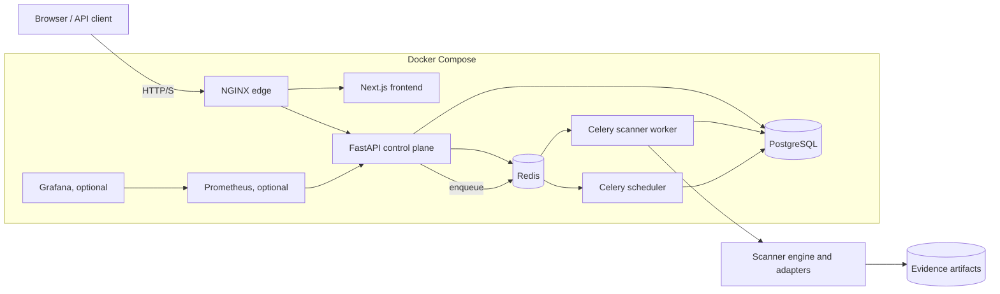
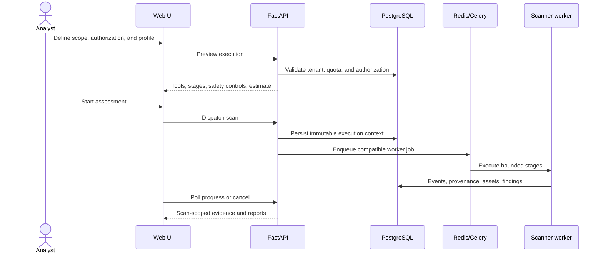

# ExposureScopeX

**Version 2.2.0**

ExposureScopeX is a Docker-first, self-hosted exposure management and security
assessment platform. It combines a Next.js operations console, FastAPI control
plane, PostgreSQL evidence model, Redis/Celery orchestration, and isolated
scanner workers for authorized ASM, web/API, MCP, cloud, repository, container,
Kubernetes, and mobile-artifact workflows.

The supported day-to-day interface is the web platform. The root
`exposurescopex.sh` command is intentionally retained as the scanner engine used
inside worker containers and as an advanced standalone operator interface. You
do not need to invoke it to run the web product.

Current product truth, deployment boundaries, and backlog are maintained in
[`webapp/docs/README.md`](webapp/docs/README.md) and
[`webapp/BACKLOG.md`](webapp/BACKLOG.md).

---

## Start the Platform

```bash
git clone https://github.com/lucky1410/ExposureScopeX.git
cd ExposureScopeX/webapp
cp .env.example .env
docker compose up -d --build
docker compose ps
```

Open the Web UI at <http://localhost:3001>, the reverse proxy at
<http://localhost:8081>, or API documentation at <http://localhost:8001/docs>.

After the first build, normal restarts do not rebuild images:

```bash
docker compose up -d
```

Use `docker compose up -d --build` only after source, dependencies, or a
Dockerfile changes. Do not use `docker compose down -v`; the `-v` option removes
the persistent PostgreSQL, Redis, and monitoring volumes.

## Architecture





### Containerization Boundary

| Component | Deployment |
|---|---|
| Frontend, API, scheduler, scanner workers | Built and run as containers |
| PostgreSQL, Redis, NGINX | Pinned upstream container images |
| Prometheus and Grafana | Optional Compose `monitoring` profile |
| Scanner CLI and shell modules | Executed inside the worker container |
| Nuclei community templates | Reusable Docker volume; refreshed without rebuilding |
| Cloud provider APIs and SaaS integrations | External services called through configured adapters |
| Kubernetes job execution | Optional external cluster integration |
| Dynamic Android/iOS testing | Optional external device/emulator adapter |

The local product stack is containerized end to end. External clouds, target
systems, Kubernetes clusters, registries, identity providers, and mobile device
farms require their own approved credentials and infrastructure.

---

## Scanner Engine Capabilities

| Category | Capabilities |
|---|---|
| **Adaptive Target Detection** | Auto-detects domain / URL / IP / CIDR and selects appropriate phases automatically. No need to specify flags manually. |
| **Passive Recon** | Zero-packet intelligence: crt.sh, public DNS, Shodan index, VirusTotal, Wayback Machine, GitHub code search, WHOIS — no packets to target |
| **Enumeration** | Subfinder, Assetfinder, crt.sh, Amass; httpx live host probing; waybackurls historical URLs |
| **DNS Recon** | A/AAAA/MX/NS/TXT/SOA/CAA; AXFR zone transfer; DNSSEC; WHOIS; ASN (Team Cymru); wildcard detection |
| **Port Scanning** | Nmap (light/medium/aggressive); optional Masscan pre-scan; CIDR targets → ping sweep then port scan |
| **SSL / TLS** | testssl.sh or openssl fallback; cert expiry; weak protocols/ciphers; 7 HTTP security headers; CORS; info disclosure |
| **Email Security** | SPF, DMARC, DKIM (12 selectors), MX, MTA-STS |
| **Web Crawler** | katana → built-in bash crawler (zero-dependency fallback); extracts API endpoints, JS files, admin pages, interesting file types |
| **Web App Testing** | Feroxbuster/Dirsearch; SQLMap; WhatWeb; Wapiti; Dalfox (XSS); Arjun; Nikto |
| **API Security** | OpenAPI/Swagger discovery; GraphQL introspection; JS secret scanning; cloud metadata SSRF probes |
| **Screenshot Capture** | gowitness → EyeWitness → built-in HTML gallery (works even with no tools installed) |
| **CVE Correlation** | Extracts product+version from nmap/WhatWeb output → queries NVD API (free, no key needed) → `cve_matches.txt` |
| **Vulnerability Scanning** | Nuclei with template aggregation across all prior outputs; Nikto |
| **OSINT** | Shodan (host + search, resolves domain→IP); VirusTotal; Censys; HIBP; theHarvester; trufflehog/gitleaks |
| **Cloud Security** | Nuclei cloud tags; S3/GCS/Azure bucket enumeration (30+ patterns); Kubernetes API exposure |
| **Autonomous Agent** | Claude AI (claude-opus-4-6) adaptively plans and executes its own enumeration strategy; agentic loop with tool-use; passive-only mode respected |
| **Findings Database** | SQLite store with `ON CONFLICT` deduplication across scans; false-positive/remediated tagging; cross-target rollup; TSV fallback |
| **Scope Enforcement** | Allowlist by exact domain, wildcard (`*.example.com`), IPv4 CIDR, or exact IP; pure-bash CIDR math |
| **Stealth Mode** | Randomised inter-tool delays (configurable min/max) to reduce WAF/IDS detection fingerprint |
| **Continuous Monitoring** | Cron-based scheduling; JSON state snapshots; `changes.md` diff across scans |
| **Reporting** | Markdown, HTML (Chart.js), PDF (pandoc), SARIF |
| **Integrations** | Slack, Microsoft Teams, Splunk HEC, syslog; jq-built payloads (injection-safe) |
| **CI/CD** | `--ci`: exits 2=CRITICAL, 1=HIGH, 0=clean |

---

## Standalone CLI Installation (Advanced)

This section is only for running the scanner engine directly on the host. Web
platform users should use the Docker workflow above.

### Requirements
- **OS**: Linux (Kali, ParrotOS, Ubuntu) or macOS (Homebrew)
- **Core**: `bash 4+`, `curl`, `jq`, `dig`, `openssl`
- **Reporting**: `pandoc` + PDF engine (`weasyprint`, `wkhtmltopdf`, or `pdflatex`)
- **Optional**: `sqlite3` (findings database; falls back to TSV without it)

### External Tools
All tools are optional — missing ones are skipped gracefully or prompt for install:

```
subfinder      assetfinder    amass          httpx          waybackurls
nmap           masscan        nuclei         nikto          testssl
feroxbuster    dirsearch      katana
sqlmap         whatweb        wapiti         dalfox         arjun
gowitness      eyewitness     theHarvester   trufflehog     gitleaks
jq             sqlite3        pandoc
```

### Setup

```bash
git clone https://github.com/lucky1410/ExposureScopeX.git
cd ExposureScopeX
chmod +x exposurescopex.sh modules/*.sh tests/*.sh
cp config/exposurescopex.conf.template config/exposurescopex.conf
nano config/exposurescopex.conf   # add API keys
```

> `config/exposurescopex.conf` is in `.gitignore`. Never commit it.

### Configuration Keys

```bash
ANTHROPIC_API_KEY=""     # for --agent mode (get key at console.anthropic.com)
SHODAN_API_KEY=""
VIRUSTOTAL_API_KEY=""
CENSYS_API_ID=""
CENSYS_API_SECRET=""
HIBP_API_KEY=""
GITHUB_TOKEN=""          # for passive.sh GitHub code search
SLACK_WEBHOOK_URL=""
TEAMS_WEBHOOK_URL=""
SPLUNK_HEC_URL=""
SPLUNK_HEC_TOKEN=""
SYSLOG_HOST=""
SYSLOG_PORT=514
SCAN_SPEED="medium"      # light | medium | aggressive
RESULTS_DIR="results"
```

---

## Standalone CLI Usage

### Adaptive Auto-Scan (no flags needed)

The tool detects what kind of target you gave it and runs the right phases automatically:

```bash
./exposurescopex.sh -d example.com         # domain → enum+scan+cloud+report
./exposurescopex.sh -d 192.168.1.50        # IP → port scan + web + vuln
./exposurescopex.sh -d 10.0.0.0/24        # CIDR → ping sweep → port scan
./exposurescopex.sh -d https://api.co/v2  # URL → web + API + vuln only
./exposurescopex.sh -f mixed.txt           # file → per-line type detection
```

`mixed.txt` can contain any combination of domains, IPs, URLs, and CIDRs — each line gets the right treatment.

### Full Manual Scan

```bash
./exposurescopex.sh -d example.com -e -s -c -r
```

### Passive-Only (No Authorization Needed)

```bash
# Safe to run before engagement starts — zero packets to target
./exposurescopex.sh -d client.com --passive-only
```

Sources: crt.sh certificate transparency, Shodan's pre-indexed data, Wayback Machine, VirusTotal passive DNS, GitHub code search, public DNS resolvers, WHOIS. Your packets go to those services — not to the target.

### Stealth Mode (Evade WAF / IDS)

```bash
./exposurescopex.sh -d target.com -s --stealth
# Random 3–15s delay between every tool call

./exposurescopex.sh -d target.com -s --stealth --stealth-min 10 --stealth-max 45
# Custom delay range

./exposurescopex.sh -d target.com -s --stealth --proxy http://127.0.0.1:8080
# Stealth + Burp Suite proxy
```

### CVE Correlation

```bash
# After a scan, correlate discovered tech with known CVEs
./exposurescopex.sh -d target.com -s --cve
# Reads nmap + WhatWeb output → queries NVD API → writes cve_matches.txt
```

### Screenshot Gallery

```bash
./exposurescopex.sh -d target.com -e -s --screenshots
# gowitness/eyewitness captures → screenshots/index.html gallery
# No tools? Generates a clickable HTML URL index automatically
```

### Continuous Monitoring

```bash
# Schedule daily scans at 02:00
./exposurescopex.sh -d example.com --interval 24 --diff --slack

# Weekly scan with Teams notification
./exposurescopex.sh -d example.com --schedule "0 2 * * 1" --teams

# View schedules / remove one
./exposurescopex.sh --list-schedules
./exposurescopex.sh -d example.com --unschedule
```

### Diff / Baseline

```bash
# Show what changed since last scan
./exposurescopex.sh -d example.com -s -r --diff

# Report only NEW findings (suppress already-known issues from report)
./exposurescopex.sh -d example.com -s -r --baseline
```

### Scope-Limited Scan

```bash
./exposurescopex.sh -d example.com -e -s --scope scope.txt
```

Scope file format:
```
# exact domain
example.com
# wildcard — matches base + all subdomains
*.example.com
# IPv4 CIDR
192.168.1.0/24
# exact IP
10.0.0.5
```

### CI/CD Pipeline Gate

```bash
./exposurescopex.sh -d staging.example.com -s --ci --baseline --auto
# Exit 0: clean   Exit 1: HIGH findings   Exit 2: CRITICAL findings
```

### Autonomous AI Agent

The `--agent` flag hands control to an embedded Claude AI (claude-opus-4-6). Instead of following a fixed phase order, the agent reasons about the target, decides which tools to call, interprets their results, and adapts its strategy — just like a human analyst would.

```bash
# Full autonomous assessment
./exposurescopex.sh -d example.com --agent

# Passive-only agent (zero packets to target)
./exposurescopex.sh -d example.com --agent --passive-only

# With final report generation
./exposurescopex.sh -d example.com --agent -r

# Adjust model or iteration cap
./exposurescopex.sh -d example.com --agent --agent-model claude-opus-4-6 --agent-max-steps 40
```

**Requires**: `ANTHROPIC_API_KEY` in `config/exposurescopex.conf` or environment.

The agent follows a 4-phase methodology (passive → enumeration → web surface → vuln assessment) with adaptive decision rules — e.g. if port 9200 is open it immediately calls `web_test` on that port for Elasticsearch; if a CMS version is detected it calls `cve_match`. It produces three output files:

| File | Description |
|---|---|
| `agent_summary.md` | Human-readable step-by-step reasoning + findings |
| `agent_session.json` | Full API conversation (for audit/replay) |
| `agent_tool_outputs.txt` | Raw output from every tool the agent called |

### Findings Database Queries

```bash
# After any scan, the findings.db is updated automatically.
# Query it directly:
sqlite3 results/findings.db "SELECT severity,title,url FROM findings WHERE status='new' ORDER BY severity;"
sqlite3 results/findings.db "SELECT title, count(DISTINCT target) targets FROM findings GROUP BY title HAVING targets > 1;"

# Mark false positives or remediated findings:
# (via db_mark_false_positive / db_mark_remediated functions in findings_db.sh)
```

---

## CLI Reference

### Target

| Flag | Description |
|---|---|
| `-d, --domain, -t, --target` | Single target — domain, URL, IP, or CIDR |
| `-f, --file FILE` | File with one target per line (mixed types accepted) |

### Scan Phases

| Flag | Description |
|---|---|
| `-e, --enum` | Subdomain enumeration + DNS recon |
| `-s, --scan` | Port scan + SSL + crawler + web + API + screenshots + vuln + CVE |
| `-c, --cloud` | Cloud misconfiguration + bucket enumeration + K8s exposure |
| `-x, --exploit` | Exploitation — Hydra SSH, Metasploit *(requires authorization)* |
| `-r, --report` | Generate MD / HTML / PDF / SARIF report |

### Autonomous Agent

| Flag | Description |
|---|---|
| `--agent` | AI-driven adaptive assessment (requires `ANTHROPIC_API_KEY`) |
| `--agent-model MODEL` | Claude model (default: `claude-opus-4-6`) |
| `--agent-max-steps N` | Max agentic iterations (default: `25`) |

### Scan Options

| Flag | Description |
|---|---|
| `-m, --mode LEVEL` | `light` \| `medium` \| `aggressive` (default: `medium`) |
| `-o, --output FILE` | Custom output filename prefix |
| `--no-osint` | Skip OSINT module |
| `--scope FILE` | Restrict to assets in scope file |
| `--diff` | Compare against previous scan; produce `changes.md` |
| `--baseline` | Report only new findings (suppresses known; implies `--diff`) |
| `--proxy URL` | Route traffic through proxy (sets `http_proxy`/`https_proxy`) |
| `--ci` | Pipeline exit codes: 2=CRITICAL, 1=HIGH, 0=clean |
| `--passive-only` | Zero-packet passive recon only — no active scan phases |
| `--stealth` | Randomised inter-tool delays (default 3–15s) |
| `--stealth-min N` | Minimum stealth delay in seconds |
| `--stealth-max N` | Maximum stealth delay in seconds |
| `--screenshots` | Capture visual snapshots of web targets |
| `--cve` | Correlate tech fingerprints with NVD CVE database |
| `--crawl` | Dedicated deep crawler phase (in addition to -s) |

### Continuous Monitoring

| Flag | Description |
|---|---|
| `--schedule CRON` | Register cron job (e.g. `"0 2 * * *"`) then exit |
| `--interval HOURS` | Schedule every N hours: `1 6 12 24 48 168` (weekly) |
| `--unschedule` | Remove scheduled monitoring for the target |
| `--list-schedules` | List all active ExposureScopeX cron entries |

### Notifications

| Flag | Description |
|---|---|
| `--slack` | Send results to Slack |
| `--teams` | Send results to Microsoft Teams |
| `--siem` | Forward logs to Splunk HEC or syslog |

### Misc

| Flag | Description |
|---|---|
| `--auto` | Non-interactive — no install prompts |
| `-v, --verbose` | Debug output |
| `-h, --help` | Help message |

---

## Interrupt Handling

Pressing **Ctrl+C** during a scan prompts:
- **`s`** — skip current tool, continue with next step
- **`q`** — quit session cleanly

A second Ctrl+C always forces immediate exit.

---

## Module Architecture

```
exposurescopex.sh                   # Orchestrator v2.2.0
config/
  exposurescopex.conf               # API keys (not committed)
  exposurescopex.conf.template      # Safe to commit
  banner.txt
  fingerprints.json
modules/
  utils.sh          — log_*, validate_*, detect_target_type, validate_cidr, run_tool, stealth delay
  safe_execution.sh — execute_with_timeout
  error_handling.sh — signal handlers, interactive Ctrl+C handler
  scope.sh          — scope enforcement (domain/wildcard/CIDR/IP), pure-bash CIDR math
  continuous.sh     — JSON state snapshots, diff, cron scheduling
  passive.sh        — zero-packet recon (crt.sh, Shodan index, Wayback, GitHub, WHOIS)
  enumeration.sh    — subfinder/assetfinder/crt.sh/amass, httpx, waybackurls
  dns_recon.sh      — DNS records, AXFR, DNSSEC, WHOIS, ASN, wildcard detection
  osint.sh          — Shodan (with IP resolution), VT, Censys, HIBP, theHarvester, trufflehog
  port_scan.sh      — nmap + masscan; CIDR→ping sweep; URL→extract host
  ssl_check.sh      — TLS/SSL, HTTP headers, SPF/DMARC/DKIM
  cloud.sh          — nuclei cloud tags, bucket enum, K8s exposure
  crawler.sh        — katana/bash crawler; API/JS/admin/file extraction
  web_test.sh       — feroxbuster, sqlmap, whatweb, wapiti, dalfox, arjun, nikto
  screenshot.sh     — gowitness/eyewitness/HTML gallery fallback
  api_security.sh   — OpenAPI, GraphQL, JS secrets, SSRF
  vuln_scan.sh      — nuclei template aggregation
  cvematch.sh       — nmap+whatweb fingerprints → NVD API → cve_matches.txt
  exploitation.sh   — Hydra SSH, Metasploit
  findings_db.sh    — SQLite findings store with dedup, tagging, cross-scan queries
  reporting.sh      — MD + HTML (Chart.js) + PDF (pandoc) + SARIF
  integrations.sh   — Slack, Teams, Splunk HEC, syslog
  agent.sh          — Autonomous AI agent (Claude API + agentic loop, 13 tools)
tests/
  run_tests.sh      — 15-test unit suite
results/
  <target>/<timestamp>/   — per-session output
  <target>/latest         — symlink to most recent
  state/<target>.json     — JSON state snapshot
  findings.db             — SQLite cross-scan findings store
```

---

## Phase Execution Order

| Phase | Module | Description |
|---|---|---|
| 0 | `passive.sh` | Zero-packet recon (always runs with `-e` or `--passive-only`) |
| 1 | `enumeration.sh` | Subdomain discovery + live host probe |
| 2 | `dns_recon.sh` | DNS records, zone transfer, DNSSEC |
| 3 | `osint.sh` | Shodan, VT, Censys, HIBP, git leaks |
| 4 | `port_scan.sh` | Nmap ± Masscan; CIDR ping sweep |
| 5 | `ssl_check.sh` | TLS, headers, email security |
| 6 | `cloud.sh` | Bucket enum, K8s exposure |
| 6b | `crawler.sh` | Recursive crawl — URLs, JS, API paths |
| 7 | `web_test.sh` | Dir brute-force, scanners |
| 8 | `api_security.sh` | OpenAPI, GraphQL, secrets |
| 8b | `screenshot.sh` | Visual snapshots |
| 9 | `vuln_scan.sh` | Nuclei across all outputs |
| 9b | `cvematch.sh` | NVD CVE correlation |
| 9c | `findings_db.sh` | DB import + cross-scan summary |
| 10 | `exploitation.sh` | Hydra, Metasploit (explicit `-x` only) |
| 11 | `continuous.sh` | State save, diff, baseline filter |
| 12 | `reporting.sh` + `integrations.sh` | Reports + notifications |

---

## Output Files (per session)

| File | Description |
|---|---|
| `passive_recon.txt` | Zero-packet intelligence report |
| `subdomains.txt` | All discovered subdomains |
| `subdomains_passive.txt` | Subdomains from crt.sh/VT passive DNS |
| `live_hosts.txt` | Hosts responding over HTTP/S |
| `wayback_urls_passive.txt` | Historical URLs from Wayback Machine |
| `nmap_scan.txt` / `.xml` | Nmap results |
| `masscan_results.txt` | Masscan pre-scan (if run) |
| `sweep_live_hosts.txt` | Live hosts from CIDR ping sweep |
| `crawl_results.txt` | All URLs discovered by crawler |
| `api_endpoints_crawled.txt` | API paths extracted from crawl |
| `js_files_crawled.txt` | JavaScript files discovered |
| `admin_pages_crawled.txt` | Admin/login pages found |
| `interesting_files_crawled.txt` | Sensitive file types discovered |
| `ssl_results.txt` | TLS and header analysis |
| `http_headers.txt` | HTTP security header audit |
| `dns_recon.txt` | DNS records, AXFR attempts |
| `api_security.txt` | API endpoint and secret findings |
| `screenshots/` | Screenshot directory + `index.html` gallery |
| `cve_matches.txt` | NVD CVE correlation results |
| `nuclei_results.txt` | Nuclei vulnerability findings |
| `changes.md` | Diff report vs previous scan (`--diff`) |
| `report.md` / `.html` / `.pdf` / `.sarif` | Final reports |
| `exposurescopex.log` | Full session log |
| `agent_summary.md` | Agent step-by-step reasoning + findings (`--agent`) |
| `agent_session.json` | Agent full API conversation for audit/replay |
| `agent_tool_outputs.txt` | Agent raw tool output log |
| `results/findings.db` | SQLite findings store (cross-scan) |

---

## Practical Use Cases

| Scenario | Command |
|---|---|
| Pentest recon (day 1) | `./exposurescopex.sh -d target.com -e -s -c -r` |
| Pre-engagement (no auth yet) | `./exposurescopex.sh -d target.com --passive-only` |
| Acquisition due diligence | `./exposurescopex.sh -d vendor.com --passive-only --cve` |
| Stealth red team | `./exposurescopex.sh -d target.com -s --stealth --proxy http://127.0.0.1:8080` |
| Bug bounty (new program) | `./exposurescopex.sh -f scope.txt -e -s --diff --screenshots` |
| Weekly ASM monitoring | `./exposurescopex.sh -d company.com --interval 168 --diff --slack` |
| Internal network audit | `./exposurescopex.sh -d 10.0.0.0/8 -s -r` |
| CI/CD pipeline gate | `./exposurescopex.sh -d staging.example.com -s --ci --baseline --auto` |
| MSSP monthly report | `./exposurescopex.sh -f clients.txt -r --baseline --slack` |
| Vendor risk assessment | `./exposurescopex.sh -d vendor.com --passive-only --no-osint` |
| **Autonomous AI assessment** | `./exposurescopex.sh -d target.com --agent -r` |
| **Agent passive-only (no auth needed)** | `./exposurescopex.sh -d vendor.com --agent --passive-only` |

---

## Running Tests

```bash
bash tests/run_tests.sh
```

15 tests covering input validation, `sanitize_filename`, scope enforcement (CIDR math, wildcards), `hours_to_cron`, state file path, and nmap output parser.

---

## Disclaimer

For **authorized security testing and educational purposes only**. Always obtain written permission before scanning any system or network you do not own. The authors accept no responsibility for misuse.
