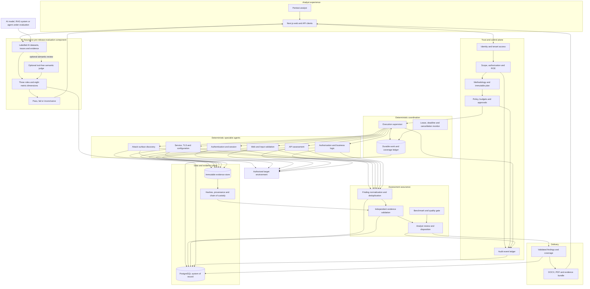

# ExposureScopeX v3 Architecture

The accepted deterministic multi-agent boundary is recorded in
[ADR-001-DETERMINISTIC-MULTI-AGENT-BOUNDARY.md](ADR-001-DETERMINISTIC-MULTI-AGENT-BOUNDARY.md).

The mandatory scanner, evidence, completion, and client-deliverable requirements
are defined in [ASSESSMENT_REPORT_CONTRACT.md](ASSESSMENT_REPORT_CONTRACT.md).
The analyst workflow and lifecycle are defined in
[ASSESSMENT_FLOW.md](ASSESSMENT_FLOW.md), and profile depth is governed by
[ASSESSMENT_PROFILE_STANDARD.md](ASSESSMENT_PROFILE_STANDARD.md). The concrete
next-step implementation target for the standard authorized application
assessment is defined in [MEDIUM_MODE_SPEC.md](MEDIUM_MODE_SPEC.md). The
backend release-quality checklist is defined in
[BACKEND_10_10_CHECKLIST.md](BACKEND_10_10_CHECKLIST.md).
The minimal adapters in the current foundation are not the final Light profile;
promotion requires satisfying that contract and its benchmark gates.

## Design goals

1. One authoritative lifecycle in PostgreSQL.
2. Typed multi-agent contracts deployed in one local runner or independently
   scaled production jobs.
3. No transient queue dependency and no browser-owned state.
4. Evidence and report generation are part of scan completion, not optional
   follow-up jobs.
5. AI may explain retained evidence after a scan but cannot plan, configure, or
   execute scanning.

## Logical architecture

The arrows represent typed, persisted contracts. Specialist agents do not call
one another and cannot create new targets or work. They emit observations and
work requests; the supervisor revalidates scope, dependency, safety, and budget
before dispatching another work unit.

### Control plane

The API validates authorization and scope, compiles a versioned immutable scan
plan, and inserts its stage work in the same database transaction. It never
invokes scanners directly.

### Multi-agent execution plane

Each agent owns a narrow capability and communicates through versioned manifests
and retained observations. The local runner hosts these agents in one process to
keep development simple. Production can run the same contracts as isolated,
autoscaled jobs without changing scan semantics.

The orchestrator claims one queued stage with `FOR UPDATE SKIP LOCKED`, obtains
a lease, revalidates scope and policy, then invokes one allowlisted agent. A
heartbeat and lease expiry make abandoned work recoverable. Each agent has a
timeout, cancellation behavior, parser version, and evidence contract.

Cross-domain work is coordinated through persisted, typed observation and work
request envelopes. Agents never invoke one another directly. The supervisor
revalidates scope, policy, dependencies and budgets before adding approved work
to the execution DAG. This permits ASM, SAST, SCA, DAST, IAST, API, cloud,
configuration, AI trust, risk and purple-assurance agents to collaborate without
creating an unauditable autonomous mesh.

### Evidence plane

Raw output is written once, hashed with SHA-256, and registered before parsing.
Normalized findings reference the exact source artifact. Finding-specific
screenshots are original browser captures and carry their own digest, target,
timestamp, and tool-run identity. Terminal exhibits are post-execution captures
of the actual isolated xterm session and are linked to the immutable terminal
transcript. The transcript is canonical machine-readable evidence; screenshots
are a human-readable supporting exhibit, not a reconstructed substitute.

### Completion gate

A scan is `complete` only when all required stages succeeded and all released
findings satisfy the evidence contract. Otherwise it is `partial`, `failed`, or
`cancelled`. Every terminal state produces a report manifest that names failed,
timed-out, skipped, and blocked coverage.

### Assurance and benchmark plane

Scanner output first becomes a candidate observation. It becomes a confirmed
finding only after normalization, deduplication, evidence-oracle validation,
scope attribution, and analyst disposition where the profile requires review.
The benchmark service consumes the same normalized observation contract but
compares it with an immutable labelled fixture. Benchmark metrics never modify
client findings and are never computed from report titles.

AI Assurance pre-release evaluation is a separate ExposureScopeX product component,
not an assessment stage or assessment benchmark. It is a modular-monolith
service containing grounding, security-verdict, and trajectory-policy roles
plus deterministic metric modules. It evaluates AI models, RAG systems and
agent workflows from their own labelled datasets, evidence and traces. It emits
`pass`, `fail`, or `inconclusive`; missing prerequisites are never converted
into perfect scores. RAG, robustness, cross-model agreement, and reproducibility
remain modules inside the same service. No evaluator role can control a scanner,
accept a scan identifier, or modify retained evidence. See
[AI_EVALUATOR.md](AI_EVALUATOR.md) for the contract and developer test flow.

### Delivery plane

Reports render one versioned fact set containing assessment context, methodology,
coverage, validated findings, limitations, evidence references, reproduction,
remediation, and retest criteria. DOCX and PDF are views of the same fact set.
The evidence bundle contains originals and a signed or hashed manifest; it is not
assembled by scraping the rendered report.

## Scan profiles

Profiles define coverage and resource budgets, not arbitrary labels.

| Profile | Intended use | Required behavior |
|---|---|---|
| Light | Rapid exposure baseline | bounded discovery, headers/TLS, curated actionable Nuclei baseline, evidence and report |
| Medium | Expanded non-destructive application assessment | Light plus authenticated session-cookie review and GET-only application/API inventory |
| Aggressive | Broad non-destructive assessment | Medium plus wider approved-surface and route-policy consistency review |

Profiles are versioned data. A scan stores the resolved plan so later profile
changes cannot alter historical meaning.

## Dependency policy

- A dependency must own a capability that cannot be maintained safely in the
  standard library or existing runtime.
- Scanner CLIs remain isolated in the runner image and never become API
  dependencies.
- Optional integrations are adapters loaded only when configured.
- Production observability exports OpenTelemetry to the operator's platform;
  it does not require bundled monitoring containers.
- SOC integration remains a deferred adapter and is not part of the current
  assessment critical path.

See [MULTI_AGENT_DESIGN.md](MULTI_AGENT_DESIGN.md) for agent responsibilities,
assurance metrics, and industry methodology mappings.

## Current versus target implementation

| Capability | Current v3 foundation | Promotion target |
|---|---|---|
| Authorization and immutable plans | Implemented | Add signed ROE, exclusions and approval granularity |
| Durable stage orchestration | Implemented | Isolated work units, hard deadlines and production queue adapter |
| Light discovery/configuration | Partial | Complete applicable Light test-case registry and benchmark gate |
| Medium application inventory and session review | Implemented | Deterministic WSTG-mapped checks with independent replay |
| Aggressive expanded observational review | Implemented | Multi-role and approved reversible workflow checks |
| Evidence and report formats | Implemented foundation | One validated fact set, concise exhibits and signed bundle manifest |
| Vulnerability benchmark scoring | Implemented foundation | Pinned fixtures, observation mapping, CI and confidence intervals |
| AI Assurance pre-release evaluation | Deterministic metrics, semantic judge adapter, audit API and UI implemented | Calibrated production datasets, pinned live judges and human review workflow |
| Analyst review workflow | Not implemented | Disposition queue, comments, overrides and approval audit |
| Optional AI analysis | Contract only | Evidence-cited advisory output after deterministic validation |
