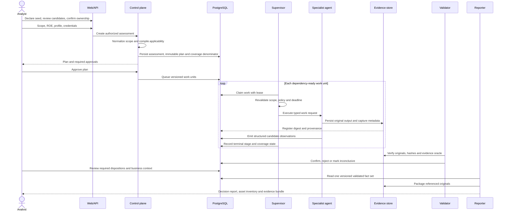
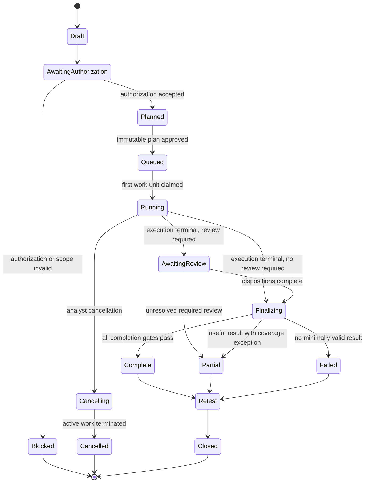
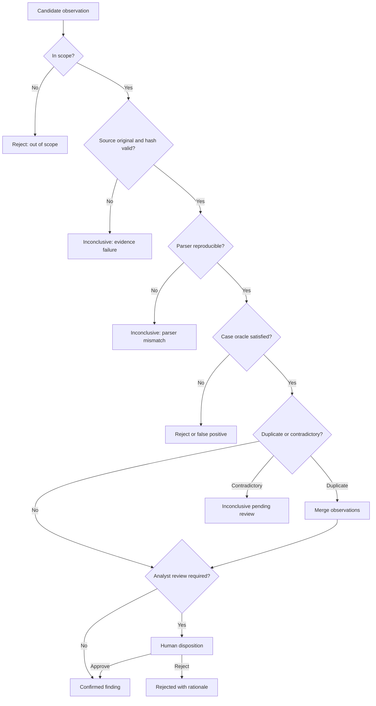

# Assessment Lifecycle and Analyst Flow

Status: target workflow contract  
Workflow version: 1.1.0-draft

## 1. Product Flow

```mermaid
flowchart LR
    A[Declare customer seed] --> B[Optional public discovery]
    B --> C[Candidate asset inventory]
    C --> D[Client confirms ownership and authorization]
    D --> E[Define exact target and scope]
    E --> F[Choose profile and credentials]
    F --> G[Applicability and capability preflight]
    G -->|blocked| X[Blocked report with reasons]
    G --> H[Approve immutable plan]
    H --> I[Execute specialist work units]
    I --> J[Ingest evidence immediately]
    J --> K[Normalize candidate observations]
    K --> L[Independent validation]
    L -->|unsupported| M[Rejected or inconclusive]
    L -->|supported| N[Analyst review when required]
    M --> O[Coverage and exception ledger]
    N --> P[Confirmed finding]
    P --> O
    O --> Q[Benchmark gate for product releases]
    O --> R[Generate client fact set]
    R --> S[Assessment decision report]
    R --> T[Asset inventory export]
    R --> U[Technical evidence bundle]
    S & T & U --> V[Retest and closure]
```

The benchmark gate evaluates the scanner product on labelled fixtures. It does
not delay a client report or rewrite client findings. Client reports disclose
coverage and validation state; release benchmarks determine whether a profile
may be marketed as production-ready.

## 2. Execution Sequence

## 3. Lifecycle State Machine

Stage terminal states remain `succeeded`, `failed`, `timed_out`, `skipped`,
`blocked`, or `cancelled`. An assessment-level Complete state is impossible when
an applicable required test is anything other than succeeded and evidence-valid.

## 4. Core Data Contracts

| Contract | Authoritative contents | Producer | Consumer |
|---|---|---|---|
| Scope decision | Targets, exclusions, ownership, authorization, window, rates, safety permissions | Scope agent | Planner, supervisor, audit |
| Asset inventory | Declared seeds, candidate assets, discovery source, confidence, ownership review, and per-asset assessment state | Inventory service | Client, planner, reporter |
| Methodology plan | Profile version, applicable test cases, dependencies, budgets, expected evidence | Planner | Supervisor, coverage ledger |
| Work request | One allowlisted capability, target subset, credentials reference, deadline, idempotency key | Supervisor | Specialist agent |
| Tool execution | Tool/adaptor identity, version, sanitized configuration, timing, exit and resource state | Specialist agent | Evidence custody, coverage |
| Artifact record | Immutable location, SHA-256, media type, size, timestamp, scope and stage IDs | Evidence custody | Validator, reporter |
| Candidate observation | Stable source identity, claim, asset, raw evidence links and parser version | Specialist/normalizer | Validator |
| Validation decision | Confirmed, rejected or inconclusive; oracle result; rationale and contradictions | Independent validator | Analyst, findings |
| Finding | Stable fingerprint, severity, confidence basis, reproduction, remediation and evidence | Finding service | Analyst, reporter, risk |
| Coverage record | Applicable/tested/result/reason per methodology case and role | Supervisor/validator | UI, reporter, benchmark |
| Benchmark result | Dataset identity, confusion matrix, precision, recall, F1, evidence and release decision | Benchmark service | Engineering release gate |
| Report fact set | Frozen assessment, coverage, findings, evidence references and approvals | Reporting service | DOCX/PDF/bundle renderers |

## 5. Asset Discovery and Ownership Flow

Public discovery can collect bounded certificate-transparency candidates from a
customer-declared seed. It does not resolve, visit, crawl, probe, or assess
those hosts. A candidate is not treated as a customer-owned asset solely
because it was discovered.

1. The client declares a seed domain or URL.
2. Public discovery records source and collection limitations for each candidate.
3. The client approves or excludes each candidate and confirms written authority.
4. Only an approved exact-origin asset can be queued for an assessment.
5. The inventory records whether that asset is queued, assessed, or blocked.
6. Every assessment result is linked back to the originating asset record.

## 6. Failure and Partial-Result Flow

`scope_preflight` is an execution barrier. If target resolution or scope
validation fails, every later queued network stage is atomically marked blocked
with the preflight failure as its cause. A scanner process that had no valid
target can therefore never be presented as successful coverage.

1. Persist tool output continuously or at bounded checkpoints.
2. Ingest candidate observations before advancing to a dependent stage.
3. On timeout, terminate the complete process group and record the hard deadline.
4. Preserve all earlier artifacts and findings.
5. Continue independent validation when its required inputs exist.
6. Mark unexecuted dependent tests blocked with a causal reference.
7. Generate a Partial, Failed, or Cancelled report from the retained fact set.
8. Permit report regeneration and analyst disposition without rerunning scanners.

## 7. Finding Decision Flow

## 8. Report Layers

The client-facing report library exposes three distinct deliverables for every
assessment record:

1. The assessment decision report (PDF, with an optional DOCX copy) explains
   authorized scope, execution state, coverage, validated findings,
   limitations, and next actions.
2. The asset inventory export (CSV) lists declared and discovered assets, their
   discovery sources, ownership state, review confidence, and assessment state.
3. The technical evidence bundle (ZIP) retains the raw, integrity-checked
   supporting artifacts for engineering and audit review.

A partial, blocked, failed, or cancelled assessment must say that coverage is
incomplete. It must not make a clean-security or absence-of-risk conclusion.

## 9. UI Flow Requirements

- Asset inventory shows the difference between a declared seed, a discovery
  candidate, an approved asset, and an excluded asset before execution.
- Assessment creation shows scope, authorization, profile behavior, prohibited
  actions, supplied roles, expected test families, and missing capabilities.
- The execution page shows current stage, current test case, real tool status,
  elapsed time, hard deadline, evidence count, findings pending validation, and
  explicit blocked/failed causes.
- Findings distinguish Candidate, Confirmed, Rejected, Inconclusive, Accepted
  Risk, and Remediated states.
- Coverage is shown by methodology family and role, not a fabricated percentage.
- Reports show readiness only after fact-set, evidence, and rendering validation.
- Benchmark pages always identify dataset, fixture digest, profile, tool versions,
  sample size, confusion matrix, precision, recall, F1, and release eligibility.
