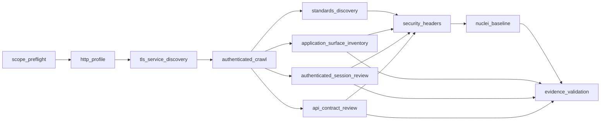

# Medium Mode Development Specification

Status: approved engineering target for the next implementation wave  
Profile version target: `medium@2026.09`  
Scanner policy: deterministic, non-AI, authorized, non-exploitative

## 1. Purpose

Medium is the standard authorized application-security assessment profile.
It must be meaningfully deeper than Light, but it must remain safe,
reproducible, and evidence-first. Medium is not defined by a larger timeout,
more screenshots, or more templates alone.

Medium exists to answer:

- What externally and authenticated-visible application routes, forms,
  parameters, APIs, cookies, headers, and services are present?
- Which non-destructive application and API weaknesses can be independently
  validated with safe deterministic checks?
- What was actually tested, what was not tested, and what was inconclusive?

Medium must not claim destructive exploitation, unrestricted business-logic
testing, credential attacks, or human-style intuition where evidence does not
exist.

## 2. Medium Contract

Medium includes every Light obligation and adds a wider, validation-oriented
application layer.

### Required outcomes

- All Light stages remain present.
- Authenticated and unauthenticated route coverage is compared when credentials
  are supplied.
- API and application inventory become first-class evidence, not side output.
- Candidate findings are only confirmed after deterministic replay,
  corroborating evidence, or a finding-specific safe oracle.
- The report must disclose Medium-specific coverage gained over Light.

### Explicit non-goals

- No exploitation payload chains.
- No brute force or credential stuffing.
- No unrestricted data extraction.
- No state-changing workflow execution unless later promoted into Aggressive and
  individually authorized.
- No AI-generated scanner decisions.

## 3. Stage Architecture

## 4. Agent Responsibilities

Medium should still run inside the current deterministic supervisor, but it must
behave like a coordinated multi-agent system with typed outputs.

| Agent or stage family | Medium responsibility | Primary evidence |
|---|---|---|
| `scope_preflight` | Enforce exact origin, scope file rules, approvals, exclusions, and deadlines | Scope decision, plan digest, preflight transcript |
| `http_profile` | Prove reachability, redirect behavior, headers, and initial response identity | Request/response artifact |
| `tls_service_discovery` | Expand host, port, service, and TLS posture coverage beyond Light | Nmap XML, service inventory, TLS observation |
| `authenticated_crawl` | Inventory same-origin routes, authenticated visibility, and browser-state coverage | Crawl manifest, original screenshots, skipped-route ledger |
| `standards_discovery` | Discover published metadata such as `robots.txt`, `sitemap.xml`, OpenID, and `security.txt` | Standards discovery artifact |
| `application_surface_inventory` | Record forms, methods, parameters, scripts, and declared client surface using safe `GET` inspection only | Surface inventory artifact |
| `authenticated_session_review` | Evaluate session-cookie controls, cookie scope, `HttpOnly`, `Secure`, `SameSite`, and session visibility | Session review artifact |
| `api_contract_review` | Detect and review published OpenAPI or Swagger contracts and declared authentication schemes | API contract artifact |
| `security_headers` | Confirm transport and browser policy control presence on recorded responses | Header audit artifact |
| `nuclei_baseline` | Execute the pinned signed non-intrusive Medium selector set against the resolved target list | Template inventory, JSONL results, terminal transcript, contextual captures |
| `evidence_validation` | Validate hash integrity, scope attribution, safe replay, screenshot admissibility, and contradictions | Validation decisions, replay artifacts, coverage exceptions |

## 5. What Medium Adds Beyond Light

| Area | Light | Medium target |
|---|---|---|
| Ports and services | Fixed common web ports | Top 100 TCP ports or explicit scope-file ports |
| Crawl depth | 2 | 3 |
| URL budget | 20 | 100 |
| Screenshot budget | 12 | 30 |
| Published metadata | Minimal | Explicit standards discovery |
| App inventory | Basic crawl list | Forms, fields, scripts, metadata, route map |
| Session analysis | Login verification only when configured | Session control review and cookie findings |
| API visibility | Opportunistic only | Contract discovery and scheme review |
| Nuclei targets | Minimal resolved set | Wider resolved route set with pinned Medium selectors |
| Validation expectation | Evidence-backed baseline | Evidence-backed baseline plus broader corroboration requirements |

## 6. Finding Families Medium Must Eventually Support

These are the deterministic families Medium should grow into, one family at a
time, without breaking the non-exploitative boundary.

### Already present in foundation

- Header and browser policy weaknesses
- Service and TLS posture observations
- Session-cookie control observations
- Published API and metadata observations
- Pinned non-intrusive Nuclei matches

### Next Medium wave

- Authentication flow weaknesses visible through safe observation and differential
  checks
- Authorization indicators using supplied-role comparisons without mutation
- Safe input-validation canaries using allowlisted reversible probes
- API authentication and authorization checks mapped to published contracts
- Client-side source and sink inventory with deterministic DOM evidence

### Deferred beyond current Medium foundation

- Multi-step business-logic invariants
- Approved reversible workflow transitions
- Multi-role matrix orchestration across complex applications
- Human-comparison benchmark claims

## 7. Evidence Contract

Every Medium stage must publish enough evidence that a reviewer can answer
"what was tested, from which source, and why is this admissible?"

### Required artifact properties

- Immutable storage key
- SHA-256 digest
- Stage, scan, and assessment identity
- Capture timestamp
- Scope attribution
- Tool or adapter identity
- Original request or structured source metadata when available
- Validation status and rationale for every released finding

### Screenshot policy

- Screenshots are supporting exhibits unless the check fundamentally depends on
  the image itself.
- A screenshot outside the exact authorized origin is never admissible as proof
  for an in-scope finding.
- When screenshots are contextual only, the report must say that the primary
  proof is request/response or source-output evidence.

### Terminal policy

- Terminal captures are real post-execution screenshots of the isolated xterm
  session.
- The terminal transcript remains the canonical machine-readable original.
- Every terminal exhibit must carry the transcript hash it was derived from.

## 8. Medium Completion Rules

Medium may be called `complete` only when:

- every required Medium stage reaches `succeeded`;
- no required stage is `failed`, `timed_out`, `blocked`, or silently stalled;
- all released findings retain valid source evidence;
- validation has dispositioned every Medium finding as confirmed, candidate,
  rejected, or inconclusive;
- every coverage exception is shown in the report; and
- the run does not rely on out-of-scope screenshots or missing originals.

If Medium executes useful work but misses any required gate, the run must remain
`partial`, not silently promoted.

## 9. Benchmark and Quality Gate

Before Medium is marketed as industry-grade, it needs a labelled benchmark set
covering:

- positive and negative web cases
- authenticated and unauthenticated cases
- API cases
- session and header cases
- route inventory expectations
- evidence-integrity failure cases

The minimum Medium benchmark publication should include:

- precision
- recall
- F1
- false-positive count
- false-negative count
- evidence completeness
- repeatability across clean resets
- per-family coverage achieved versus applicable coverage

## 10. Implementation Order

### Wave 1: stabilize current Medium foundation

- keep Light pipeline behavior intact
- ensure Medium reports every stage and exception clearly
- make inventory and session-review outputs first-class in the report
- ensure Nuclei, screenshots, and validation obey the same evidence policy as Light

### Wave 2: add deterministic Medium validations

- add safe authentication and authorization comparison adapters
- add allowlisted input-validation canary adapters
- add stronger API contract to endpoint validation logic
- add per-family coverage counts to the report

### Wave 3: benchmark and promote

- define immutable Medium fixtures
- publish the benchmark manifest and oracles
- measure precision, recall, F1, evidence completeness, and repeatability
- promote Medium only after passing the release gate

## 11. Current Development Position

As of this document, the codebase already has:

- a real Medium stage list in the plan compiler,
- larger crawl, service, screenshot, and Nuclei budgets than Light,
- standards discovery,
- application surface inventory,
- authenticated session-cookie review, and
- API contract review.

What is still missing for a true Medium release claim:

- deterministic safe validation adapters for authz, input validation, and
  richer API checks,
- benchmark-backed proof of precision and recall for Medium,
- clearer per-family report disclosure, and
- analyst-grade evidence presentation for the added Medium stages.
