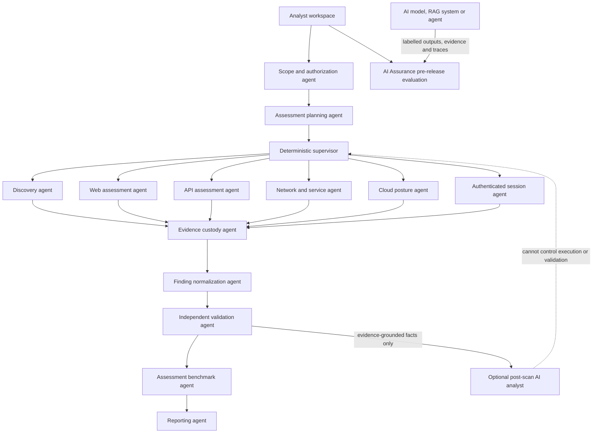
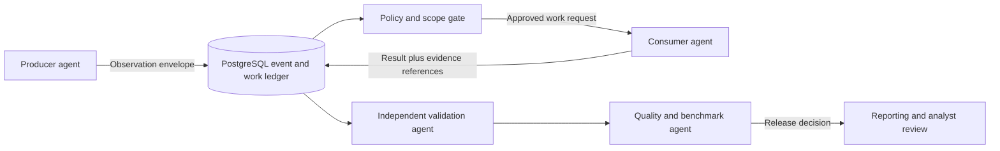

# Multi-Agent Assessment Design

## Product definition

ExposureScopeX is a production-grade, multi-agent red-team assessment platform
for authorized, deterministic, non-exploitative vulnerability assessment. It
also contains AI Assurance pre-release evaluation for AI models, RAG systems, and agent
workflows. The evaluator is a peer product component, not a stage in the
vulnerability-assessment execution flow.

An agent is an independently versioned capability with a typed input manifest,
declared safety class, bounded resources, deterministic output schema, evidence
contract, and measurable acceptance criteria. An agent is not automatically an
LLM. Scan execution agents must not use generative AI.

## Agent topology

## Federated agent domains

Agents are grouped into bounded domains. A domain can contain multiple workers,
but each worker still has one versioned contract and one safety policy.

| Domain | Specialist agents | Primary handoffs |
|---|---|---|
| Attack surface management | Seed attribution, DNS/certificate discovery, service inventory, technology profiling, exposure drift | Supplies attributed assets and endpoints to web, API, cloud, configuration and correlation agents |
| Application security | SAST, SCA/SBOM, secrets, DAST, IAST import, API assessment, mobile static assessment | Shares source-component-route relationships and candidate findings with normalization and correlation |
| Infrastructure security | Network/service, TLS, cloud posture, Kubernetes, container/image, IaC and configuration/passive audit | Shares assets, identities, dependencies, configuration observations and evidence |
| AI security and trust | LLM/agent security, RAG integrity, MCP/tool boundary, model/API configuration and external AI compliance/trust | Shares evidence-backed control observations with compliance, risk and reporting agents; never controls scanners |
| Risk and assurance | Finding normalization, evidence validation, deduplication, asset criticality, non-exploitative risk-path correlation and remediation verification | Consumes all domain observations and produces validated, traceable finding identities |
| Purple assurance | ATT&CK/control mapping, telemetry coverage, detection-rule review, logging-gap analysis and control-effectiveness evaluation | Consumes validated findings and approved defensive telemetry; SOC transport remains a deferred adapter |
| Quality and delivery | Benchmark/evaluation, report generation, evidence packaging and release gating | Independently scores agents and publishes only evidence-grounded results |

## Inter-agent interaction contract

Agents do not communicate through unrestricted natural-language conversations.
They exchange typed, persisted messages through the supervisor so every decision
is reproducible and auditable.

Every handoff envelope contains:

- Tenant, assessment, scan, stage, producer agent and contract versions.
- Canonical target or asset identifiers and the immutable scope digest.
- Message type: observation, work request, validation decision, exception or result.
- Structured payload schema version and idempotency key.
- Source artifact identifiers, SHA-256 values and capture timestamps.
- Confidence basis, data classification, authorization and safety class.
- Causation and correlation identifiers for end-to-end traceability.
- Expiry, retry budget and required terminal outcome.

An agent may request another agent only through the supervisor. The supervisor
checks that the destination is permitted by the immutable assessment plan, the
target remains in scope, required evidence exists, and request/rate budgets are
available. Dynamically requested work is appended to the durable execution DAG
and cannot bypass analyst approval gates.

## Interaction examples

- The ASM technology profiler identifies an API endpoint and requests an API
  inventory pass; it cannot directly launch API tests.
- SAST identifies a dependency and route, while SCA provides the component
  version and DAST provides runtime reachability. Correlation may combine these
  observations, but validation must retain all three evidence chains.
- IAST imports an instrumented runtime observation and links it to matching SAST
  and DAST identities without allowing IAST telemetry to modify the target.
- Cloud posture discovers an internet-facing service and asks ASM to verify
  external exposure through a scoped work request.
- The AI trust agent maps retained model, data and control evidence to governance
  requirements. It may explain gaps but cannot configure or execute scans.
- Purple assurance maps a validated finding to expected telemetry and detection
  controls, then records coverage gaps without executing an attack simulation.

## Coordination roles

| Coordination agent | Authority boundary |
|---|---|
| Portfolio planner | Selects approved domain capabilities from the requested assessment type; cannot invent targets or tools |
| Deterministic supervisor | Owns the execution DAG, dependencies, leases, retries, concurrency, cancellation and terminal states |
| Correlation agent | Links assets, components, routes, identities, controls and observations; cannot promote a candidate to a validated finding |
| Independent validation agent | Accepts, rejects or requests bounded evidence for a candidate finding; cannot alter original artifacts |
| AI Assurance pre-release evaluation | Independently measures AI-system accuracy, grounding, calibration, security outcomes, trajectory quality, RAG quality, robustness and reproducibility; it is not part of assessment execution |
| Human approval gate | Authorizes scope expansion, credentials, higher-impact profiles, exceptions and final publication |

AI Assurance pre-release evaluation is one bounded modular-monolith component, not a mesh of
deployments. Its logical roles are evidence grounding, labelled security-verdict
measurement, and trajectory/policy evaluation. RAG, robustness, cross-model
agreement, and repeated-run reproducibility remain modules inside the same
component. It accepts no assessment or scan identity and cannot control the
assessment supervisor. A required dimension that lacks ground truth is
`inconclusive`; it is never represented as a perfect score.

## Responsibilities

| Agent | Responsibility | Required output |
|---|---|---|
| Scope and authorization | Canonicalize target boundaries, exclusions, window, rates, credentials and authorization | Signed policy decision and immutable scope digest |
| Planning | Resolve Light, Medium or Aggressive profile into ordered work units | Versioned execution manifest and coverage expectation |
| Supervisor | Enforce dependencies, leases, cancellation, retry budgets and terminal states | Durable lifecycle events; no silent stage |
| Discovery | Passive and bounded active asset/endpoint discovery | Attributed assets, URLs and raw outputs |
| Network and service | Safe host, port, protocol, TLS and service enumeration | Service observations and command provenance |
| Web assessment | Headers, configuration, curated templates and bounded safe validation | Candidate findings with source evidence |
| API assessment | OpenAPI discovery and non-destructive OWASP API checks | Endpoint inventory and evidence-linked findings |
| Authenticated session | Establish, verify and safely maintain approved browser/API sessions | Redacted session proof and authenticated coverage |
| Cloud posture | Read-only cloud resource and configuration assessment | Provider-attributed resources and findings |
| Evidence custody | Preserve original raw output, screenshots and metadata | Immutable artifact record, SHA-256 digest and chain of custody |
| Finding normalization | Parse tool-specific output into one stable model | Fingerprinted observation retaining parser and source versions |
| Independent validation | Reject unsupported, contradictory or out-of-scope claims | Validation decision, confidence rationale and evidence links |
| Benchmark and quality | Compare agent results with labelled fixtures and regression baselines | Precision, recall, F-score, false-positive/negative and coverage metrics |
| Reporting | Render one pinned fact set into all approved formats | Final or Partial report plus evidence manifest |
| Optional AI analyst | Explain, prioritize and draft remediation from retained evidence | Cited draft with model/prompt provenance and human approval state |

## Supervisor rules

The supervisor is a deterministic state machine, not a general-purpose LLM. It
may dispatch only agents listed in the immutable plan. It cannot invent new
targets, tools, payloads or retries. Every work unit transitions to `succeeded`,
`failed`, `timed_out`, `skipped`, `blocked`, or `cancelled`. A required non-success
outcome forces a Partial or Failed assessment and remains visible in the report.

## Independent assurance loop

The validation agent never evaluates its own scanner implementation. It checks:

1. Target and scope attribution.
2. Original source artifact availability and checksum validity.
3. Parser reproducibility from retained raw output.
4. Finding-specific evidence and reproduction steps.
5. Severity/vector consistency and remediation relevance.
6. Contradictory observations and duplicate identities.
7. Required coverage gaps and authentication state.

The benchmark agent runs controlled, labelled fixtures and computes:

- Precision = true positives / all reported positives.
- Recall = true positives / all expected positives.
- F1 = harmonic mean of precision and recall.
- False-positive and false-negative rates by agent, check family and profile.
- Evidence completeness and reproducibility rates.
- Stage completion, timeout, retry and silent-worker rates.
- For optional AI only: citation correctness, unsupported-claim rate,
  hallucination rate and human override rate.

No accuracy score is published without its labelled dataset, profile version,
tool/template versions, sample size and confidence interval.

## Industry methodology baseline

The methodology registry pins versions and maps every check to one or more
recognized references. Initial governing sources are:

- NIST SP 800-115 for planning, execution, analysis and mitigation workflow.
- OWASP Web Security Testing Guide using stable versioned scenario identifiers.
- OWASP ASVS for verifiable application security control requirements.
- OWASP API Security Top 10 and WSTG API scenarios for API coverage.
- CVSS v4.0 for technical severity, retaining both score and vector.
- CWE for weakness identity and CAPEC/MITRE ATT&CK only for contextual mapping.
- NIST SSDF for remediation and secure-development recommendations.

Mappings describe coverage; they do not imply certification or complete
compliance. Every report discloses profile, excluded tests, failed stages,
authentication coverage and limitations.

## Deployment model

### Local

One runner process hosts all deterministic agents. PostgreSQL provides lifecycle
state and low-volume durable work claiming. Evidence uses a controlled local
volume. This minimizes installation and debugging dependencies.

### Production

The same agent manifests are delivered through a queue abstraction backed by a
managed broker. Specialist agents run as isolated, autoscaled jobs with resource
limits, network policy, workload identity and tenant concurrency controls.
PostgreSQL remains authoritative; immutable evidence moves to retention-locked
object storage. The queue is replaceable infrastructure, not business logic.

## Current implementation boundary

The v3 alpha currently implements the control-plane skeleton, PostgreSQL work
claiming, the local agent host, HTTP/header checks, raw artifact hashing,
normalization, basic findings, lease recovery, report manifests, a versioned
agent registry, durable handoff/evaluation records, and standalone AI Assurance pre-release evaluation
with deterministic metrics, a guarded semantic-judge adapter, provenance, and
offline fixtures. Planned registry entries are architecture commitments, not
claims that those domain agents already execute.

SOC integration is intentionally deferred until assessment execution, evidence,
validation, benchmarking and reporting meet their release gates.
