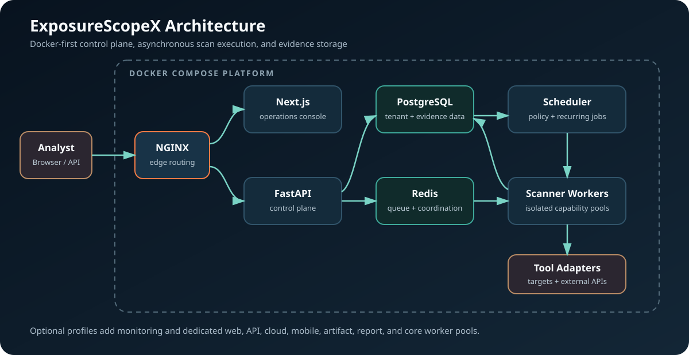
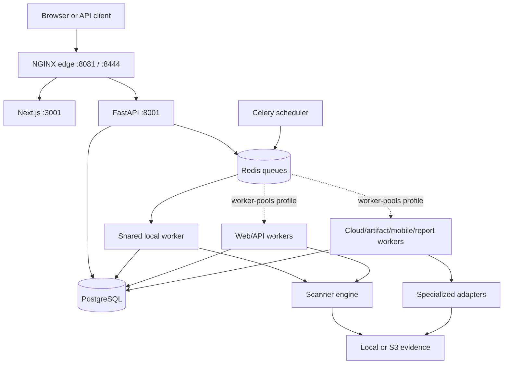

# ExposureScopeX Web Application



The complete local stack is defined in [`docker-compose.yml`](docker-compose.yml).
See the root [`DOCKER_SETUP.md`](../DOCKER_SETUP.md) for startup, profiles,
persistence, and rebuild behavior.

> Documentation validated 2026-09-10. Start at `docs/README.md`; current schema head is `018_operation_control_plane`.

**AI-Assisted Attack Surface Management & Security Reconnaissance Platform**

A controlled self-hosted platform for security engineers, SOC teams, and penetration testers to discover, assess, monitor, and investigate authorized attack surfaces. See `docs/PRODUCT_STATUS.md` for production-readiness boundaries.

---

## Architecture



| Service | Technology | Port | Purpose |
|---------|-----------|------|---------|
| Frontend | Next.js 15, TypeScript, Tailwind, shadcn/ui | 3001 loopback | Web interface |
| Backend | FastAPI, SQLAlchemy, Pydantic | 8001 loopback | REST API and control plane |
| Database | PostgreSQL 16 | Internal | Persistent storage |
| Cache/Queue | Redis 7 | Internal | Celery, rate limits and pub/sub |
| Worker | Celery + version-pinned scanner image | None | Background execution |

---

## Quick Start

### Prerequisites

- Docker and Docker Compose
- Git

### 1. Clone and configure

```bash
cd webapp
cp .env.example .env
# Edit .env if you want to configure API keys (optional for demo)
```

### 2. Start all services

```bash
docker compose up -d --build
```

The first start builds the application and scanner images. For normal day-to-day
restarts, use `docker compose up -d` without `--build`. Rebuild only after a
Dockerfile, dependency, or copied worker/frontend/backend source changes.

Worker startup refreshes Nuclei templates only when stale, and Celery Beat performs the same locked refresh daily. Community sources use shallow fetch/reset plus Git garbage collection, so restarts and scans do not repeatedly clone repositories. Repository assessments keep a shallow checkout while pruning `.git` metadata by default to reduce artifact growth.

### 3. Access the application

- **Web UI**: http://localhost:3001
- **Reverse proxy**: http://localhost:8081
- **API Docs**: http://localhost:8001/docs
- **API Health**: http://localhost:8001/health

### 4. Create the initial administrator

On a new empty database, registration creates the first organization administrator. Public registration is disabled after bootstrap by default; additional users are created by an administrator in Settings.

Assessment creation now queues a scan in the same API call by default, so the UI does not need to race a second "start scan" request.

---

## Features

### Operations
- **Dashboard** — Attack surface overview with risk scores, severity charts, vulnerability trends, and recent findings
- **ASM** — External target inventory, discovery, cloud sources, cancellation, and findings
- **Assessments & Scans** — Multi-asset intake, preview, profiles, execution, progress, retry, clone, and cancellation
- **Operations & Coverage** — Queue, work-unit, worker capability, tool provenance, and coverage visibility
- **Assets & Exposure Graph** — Inventory, evidence, ownership, relationships, attack paths, drift, and timelines
- **Vulnerabilities** — CVE correlation with CVSS, EPSS, and CISA KEV integration
- **Findings** — Scan-scoped evidence observations and lifecycle workflow

### Intelligence
- **Recon & OSINT** — 25+ categorized security tools and resources (Shodan, Censys, crt.sh, etc.)
- **Security Testing** — Reference library (HackTricks, PayloadsAllTheThings, SecLists, GTFOBins, LOLBAS)
- **Privilege Escalation** — Windows and Linux privesc tools with MITRE ATT&CK mappings
- **Malware Analysis** — File hash investigation and sandbox references (VirusTotal, ANY.RUN)
- **Threat Intelligence** — Vulnerability databases, IOC feeds, and threat actor intel
- **MCP Security** — Non-destructive MCP endpoint inventory, protocol checks, exchanges, cancellation, and findings
- **Bug Hunting** — Guarded utilities plus practitioner workflows; not every referenced tool is executable

### Analysis
- **AI Security Analyst** — Chat interface for querying findings and attack surface data
- **Investigations** — Create investigation workspaces with evidence, notes, and timelines
- **Reports** — Generate PDF, CSV, and JSON reports for different audiences

### Knowledge
- **Resource Library** — 80+ curated security resources with favorites, search, and tags
- **Learning Center** — TryHackMe, Hack The Box, security news, certifications, and podcasts

### System
- **Notifications** — Real-time alerts for new assets, CVEs, and risk changes
- **Settings** — API key management, user administration, scan authorization

---

## Demo Data

The application includes a complete demo dataset for the fictional company **AcmeCorp**:

| Entity | Count | Details |
|--------|-------|---------|
| Assets | 15 | acmecorp.com + subdomains + IPs |
| DNS Records | 14 | A, MX, NS, TXT, SOA, CAA |
| Open Ports | 14 | HTTP, HTTPS, SSH, MySQL, Redis, Elasticsearch |
| Technologies | 12 | Apache, nginx, WordPress, Node.js, React, PHP |
| TLS Certificates | 4 | Valid, expired, weak key, EV cert |
| Vulnerabilities | 8 | CVE-2021-44228, CVE-2023-44487, CVE-2024-3094, etc. |
| Findings | 50 | 5 CRITICAL, 10 HIGH, 15 MEDIUM, 12 LOW, 8 INFO |
| Resources | 80+ | Across all security categories |

Demo data is clearly marked with a "DEMO DATA" banner in the UI.

---

## API and Data Model

Application endpoints use `/api/v1`. Interactive schemas are available at
`/docs` and `/openapi.json`. See `docs/API.md` for endpoint families and
`docs/DATA_MODEL.md` for tenant ownership and execution relationships. Alembic
migrations are authoritative; documentation intentionally does not duplicate a
fragile table count.

---

## Security Controls

- **Authentication**: JWT/session access (60min default) + rotating refresh (7 day default)
- **RBAC**: admin, manager, analyst, viewer roles
- **API Key Encryption**: Fernet symmetric encryption at rest
- **Audit Logging**: All sensitive actions logged with user, IP, timestamps
- **Scan Authorization**: Explicit authorization required before scanning
- **Rate Limiting**: nginx reverse proxy with configurable limits
- **CORS**: Configurable allowed origins
- **Input Validation**: Pydantic schemas on all endpoints

---

## Development

### Makefile Commands

```bash
make dev          # Start with hot reload
make build        # Build Docker images
make up           # Start in background
make down         # Stop services
make logs         # Follow all logs
make migrate      # Run database migrations
make seed         # Seed demo data
make test         # Run all tests
make clean        # DESTRUCTIVE: remove project containers, images, and volumes
make reset        # DESTRUCTIVE: reset database and volumes
make shell-backend  # Backend shell
make shell-db     # PostgreSQL shell
```

### Manual Development

```bash
# Backend
cd backend
pip install -r requirements.txt
uvicorn app.main:app --reload --port 8000

# Frontend
cd frontend
npm install
npm run dev
```

### Environment Variables

See `.env.example` for all configuration options. Key variables:

| Variable | Required | Description |
|----------|----------|-------------|
| `DATABASE_URL` | Yes | PostgreSQL connection string |
| `REDIS_URL` | Yes | Redis connection string |
| `SECRET_KEY` | Yes | JWT signing key |
| `SEED_DEMO_DATA` | No | Auto-seed demo data (default: true) |
| `ANTHROPIC_API_KEY` | No | For AI Security Analyst feature |
| `SHODAN_API_KEY` | No | For live Shodan integration |
| `VIRUSTOTAL_API_KEY` | No | For live VirusTotal integration |

---

## Project Structure

```
webapp/
├── docker-compose.yml      # Service orchestration
├── .env.example             # Environment template
├── Makefile                 # Development commands
├── BACKLOG.md               # Canonical current backlog
├── README.md                # This file
├── docs/README.md           # Canonical documentation index
│
├── frontend/                # Next.js 15 application
│   ├── Dockerfile
│   ├── package.json
│   ├── tailwind.config.ts   # Dark cybersecurity theme
│   └── src/
│       ├── app/             # App Router product modules
│       ├── components/      # Shared product and UI components
│       └── lib/             # Utils, types, API client, demo data
│
├── backend/                 # FastAPI application
│   ├── Dockerfile
│   ├── requirements.txt
│   ├── alembic/             # Database migrations
│   └── app/
│       ├── models/          # Tenant, evidence, runtime and lifecycle models
│       ├── schemas/         # Pydantic request/response contracts
│       ├── api/v1/          # Versioned application API families
│       └── services/        # Planning, policy, adapters, parsers and storage
│
├── worker/                  # Celery scan worker
│   ├── Dockerfile
│   ├── entrypoint.sh
│   └── tasks.py             # Scan execution tasks and adapters
│
├── seed/                    # Seed data files
│   └── security_resources.json  # 80+ curated resources
│
└── nginx/                   # Reverse proxy config
    └── nginx.conf
```

---

## Technology Stack

### Frontend
- Next.js 15 (App Router, Server Components)
- TypeScript
- Tailwind CSS (dark cybersecurity theme)
- shadcn/ui (21 Radix UI components)
- Recharts (charts and visualizations)
- TanStack Table (data tables)
- Zustand (state management)
- cmdk (Ctrl+K command palette)
- Lucide React (icons)

### Backend
- FastAPI
- SQLAlchemy 2.0 (async)
- Alembic (migrations)
- Pydantic v2 (validation)
- python-jose (JWT)
- passlib (bcrypt)
- Celery + Redis (task queue)
- cryptography (Fernet encryption)

### Infrastructure
- PostgreSQL 16
- Redis 7
- Docker + Docker Compose
- nginx (reverse proxy)

---

## License

ExposureScopeX is designed for **authorized defensive security assessments only**. Active scanning and testing should only be performed against systems you have explicit authorization to test.
