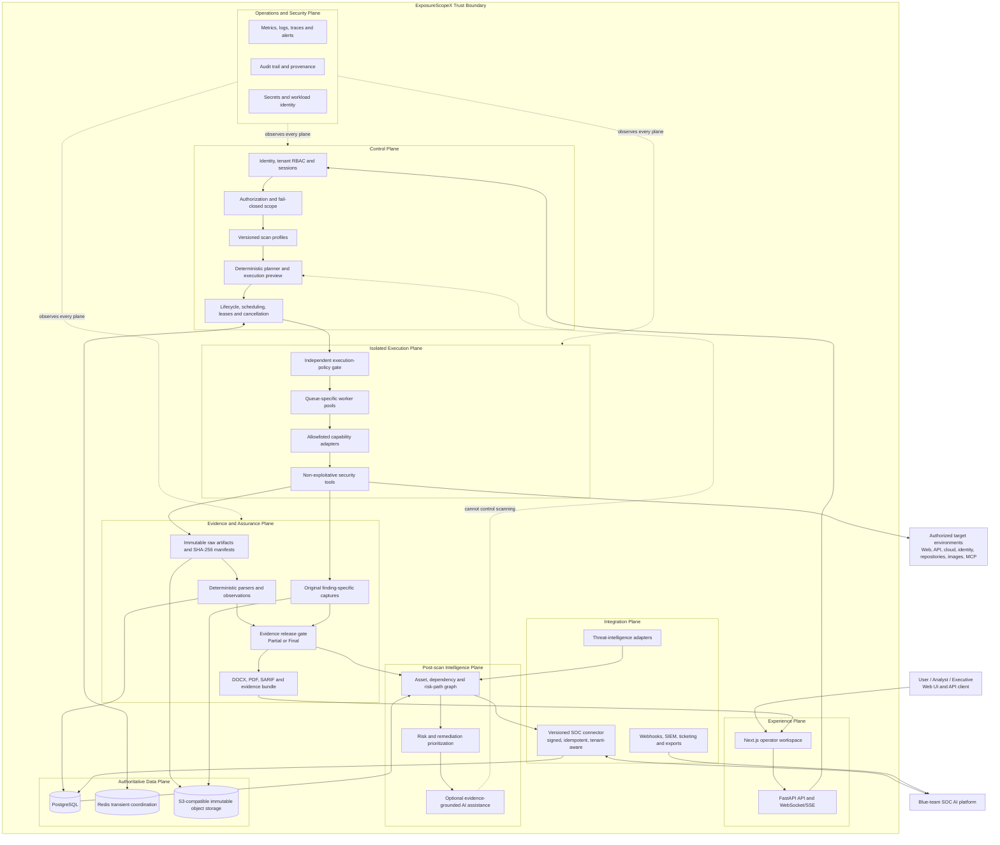

# ExposureScopeX Reference Architecture

**Status:** Governing target architecture
**Reviewed:** 2026-09-10
**Decision authority:** [Architecture](ARCHITECTURE.md) and
[ADR 0005](adr/0005-deterministic-non-exploitative-evidence-gated-scanning.md)

This model is intentionally editable and provider-neutral. It adapts the supplied
AI red-team platform example to ExposureScopeX's deterministic, non-exploitative,
evidence-gated product boundary. AWS is one production mapping, not an application
dependency.

## System view

The dotted AI-to-planner edge is a prohibition, not a data flow: AI cannot alter
targets, tools, templates, payloads, timing, retries, or scope. The platform has no
adversarial simulation or exploitation engine.

## Layer responsibilities

| Layer | Concrete responsibility | Primary contract |
|---|---|---|
| Experience | Scope definition, preview, progress, findings, evidence, reports, operations | Never invent success or hold authoritative lifecycle state in the browser |
| Control | Authenticate, authorize, validate scope, compile immutable plans, dispatch and recover work | One tenant-owned manifest and policy decision per dispatch |
| Execution | Run fixed adapters in isolated bounded workers | Revalidate policy and scope; emit terminal status for every planned stage |
| Evidence | Preserve raw outputs, captures, hashes, provenance, observations and report artifacts | A finding is confirmed only when its source and original capture are traceable |
| Intelligence | Build risk paths, prioritize remediation and optionally explain evidence | Derived claims cite immutable facts and cannot mutate scanner truth |
| Integration | Exchange controlled data with SOC, SIEM, ticketing and intelligence systems | Versioned schemas, scoped identity, signatures, replay protection and idempotency |
| Operations | Observe health, cost, queue lag, security events, retention and recovery | No silent stalls; every failure has an owner-visible state and recovery path |

## Capability boundary

The worker adapter layer is an internal typed capability contract, not an open
plugin marketplace and not an AI tool bus. Each adapter declares supported target
types, required worker capabilities, version, arguments, expected artifacts,
resource limits, timeout, retry policy, safety class, and parser version.

Allowed classes include passive discovery, DNS and service discovery, bounded
content discovery, configuration checks, curated non-destructive templates, static
artifact analysis, cloud posture collection, and evidence capture. SQLMap, Hydra,
Metasploit, credential attacks, exploit execution, persistence, command-and-control,
destructive templates, and autonomous attack simulation are rejected.

## End-to-end transaction

1. The analyst creates an assessment with objectives, authorization, and explicit scope.
2. A versioned profile compiles into an immutable execution manifest.
3. Plan and dispatch gates validate tenant ownership, scope, policy, quota, and worker capability.
4. Workers independently validate the manifest and run bounded non-exploitative stages.
5. Every stage emits heartbeats, progress, terminal outcome, command provenance, and hashed artifacts.
6. Deterministic parsers create observations and finding identities without losing source attribution.
7. Finding-specific capture records preserve original images, timestamps, target identity, and hashes.
8. The evidence gate assigns Partial or Final report eligibility and records every coverage gap.
9. Reports and evidence bundles are generated idempotently and remain traceable to the scan manifest.
10. Post-scan intelligence may correlate risk and SOC telemetry without changing retained scan facts.

## Deployment mappings

| Concern | Local development | Production reference |
|---|---|---|
| Edge | Loopback nginx | Managed TLS ingress/WAF and exact origins |
| Application | Docker Compose frontend/backend | Containerized stateless replicas on Kubernetes/ECS |
| Execution | Shared or queue-specific Compose workers | Ephemeral per-scan Jobs with egress policy and workload identity |
| State | PostgreSQL and Redis volumes | Managed PostgreSQL, managed Redis, encrypted backups and tested restoration |
| Evidence | Controlled local storage | Versioned object storage with encryption, retention lock and tenant prefixes |
| Secrets | Protected environment file | External secrets manager and short-lived workload identity |
| Observability | Compose Prometheus/Grafana | Central metrics, logs, traces, audit archive and paging |
| SOC integration | Disabled or local test adapter | Private authenticated endpoint with retry and dead-letter handling |

## Delivery increments

The current critical path is increments A through E. SOC integration remains a
designed extension point and is not a near-term delivery dependency.

| Increment | Exit condition |
|---|---|
| A. Architecture contract | Diagrams, ADRs, schema heads, terminology and automated conformance agree |
| B. Reliable execution | No unbounded or silent stage; policy, scope, timeout, cancellation and recovery tests pass |
| C. Forensic evidence | Original finding captures and hashed artifacts survive ingestion and report generation |
| D. Report control plane | Completed, cancelled and failed scans produce accurate recoverable Partial/Final reports |
| E. Risk-path intelligence | Graph and prioritization are deterministic and evidence-linked |
| F. Production platform | Reference deployment passes security, load, backup/restore, RPO/RTO and failure tests |
| Deferred: SOC feedback loop | Implement only when reprioritized; contract must pass authentication, isolation, idempotency and journey tests |

## Explicitly unresolved decisions

- Production runtime selection: Kubernetes, ECS, or both.
- Evidence immutability mechanism and retention-lock policy.
- SOC platform API schema, identity model, transport, and ownership of case state.
- Post-scan model provider, data-residency boundary, redaction, and approval workflow.
- Organization-level RPO/RTO, scan concurrency, storage sizing, and evidence retention tiers.

These decisions require ADRs before implementation changes their respective trust
boundaries.
